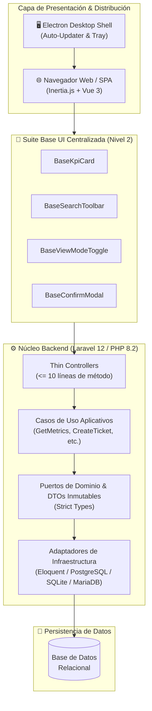
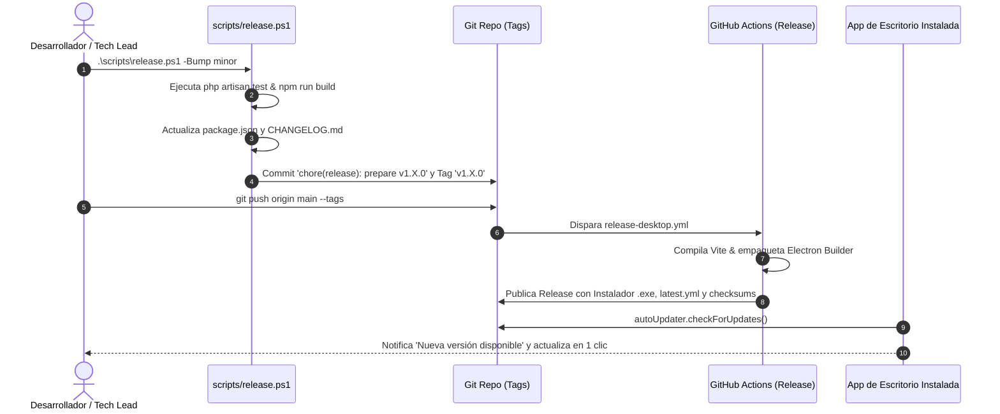

<div align="center">

# 🛡️ SGEN-Support
### Sistema Integral de Gestión Técnica, Soporte Operativo y Control de Activos

[](https://github.com/Jonas-a1105/SGEN-Support/actions)
[](https://github.com/Jonas-a1105/SGEN-Support/releases/latest)
[](https://www.php.net/)
[](https://laravel.com)
[](https://vuejs.org/)
[](https://inertiajs.com/)
[](https://www.electronjs.org/)
[](#licencia)

<p align="center">
  Plataforma unificada para gestión de tickets deportivos, auditoría operativa, control de inventario de equipos y mantenimientos preventivos.
  <br />
  <strong>Disponible como aplicación web moderna SPA (Inertia.js + Vue 3) y como instalador de escritorio autónomo con actualización automática.</strong>
</p>

</div>

---

## 🏛️ Topología y Arquitectura del Sistema

SGEN-Support está diseñado bajo una arquitectura desacoplada y escalable basada en **Domain-Driven Design (DDD)** y **Arquitectura Hexagonal (Puertos y Adaptadores)**:



---

## ✨ Características Principales

### 🎯 Experiencia de Usuario (UI/UX)
- **Suite UI Centralizada**: Componentes base compartidos (`BaseKpiCard`, `BaseSearchToolbar`, `BaseViewModeToggle`, `BaseConfirmModal`, etc.) que garantizan consistencia en los 11 módulos de la aplicación.
- **Tarjetas KPI Interactivas**: Indicadores con borde animado de acento (`4px`), hover responsivo (`translateY(-2px)`), íconos delimitados con fondo transparente y tipografía cuidada sin forzar mayúsculas.
- **Fidelidad al Kit de Diseño**: Cumplimiento del 100% de la estética original: **cero estilos inline** (`style="..."`), **cero sombras duras** (`box-shadow: none !important;`) y variables semánticas centralizadas.
- **Vistas Adaptables**: Selector instantáneo entre vista de cuadrícula (cards) y vista tabular con persistencia de preferencias.

### 💼 Capacidades de Negocio
- **Dashboard Operativo**: Métricas en tiempo real de volumen de tickets, ratio de disponibilidad de inventario, rendimiento técnico y gráfico mensual interactivo.
- **Gestión de Tickets y Soporte**: Ciclo de vida completo (Pendiente, En Proceso, Resuelto), priorización y reasignación técnica.
- **Control de Inventario**: Trazabilidad de equipos deportivos, seriales, estado operativo y bajas de material.
- **Mantenimientos**: Programación preventiva y correctiva con reportes PDF descargables.
- **Auditoría Integral**: Bitácora inmutable de acciones de usuario con registro de eventos y timestamps.

### 🚀 Distribución y Actualización Automática
- **Instalador de Escritorio Autónomo**: Empaquetado Windows (`NSIS`) con MariaDB/SQLite y PHP embebido listo para usar sin requerir servidores locales preinstalados.
- **Actualización Automática (`electron-updater`)**: Cada nueva versión publicada en GitHub Releases es detectada automáticamente en segundo plano por el cliente de escritorio, ofreciendo una actualización limpia en un clic.

---

## 🛠️ Tecnologías y Estándares

| Componente | Tecnologías |
| :--- | :--- |
| **Backend Core** | PHP 8.2+, Laravel 12.x, Inertia.js Laravel Adapter |
| **Frontend SPA** | Vue 3.5+, TypeScript 5+, Tailwind CSS 4, Lucide Icons, Pinia |
| **Herramientas de Build** | Vite 7.x, Laravel Vite Plugin |
| **Desktop Shell** | Electron 39.x, Electron Builder, Electron Updater |
| **Calidad y Linter** | PHPUnit 11.5, Laravel Pint, Conventional Commits |
| **Integración Continua** | GitHub Actions (CI & Automated Desktop Release) |

---

## 🚀 Inicio Rápido para Desarrollo

### Requisitos Previos
- **PHP** $\ge 8.2$ con extensiones (`pdo`, `mbstring`, `openssl`, `curl`, `sqlite3`, `zip`).
- **Composer** $\ge 2.5$.
- **Node.js** $\ge 20.x$ y **NPM** $\ge 10.x$.

### 1. Entorno de Desarrollo Web
```bash
# Clonar el repositorio
git clone https://github.com/Jonas-a1105/SGEN-Support.git
cd SGEN-Support/sgen-backend

# Instalar dependencias de PHP
composer install

# Configurar variables de entorno
cp .env.example .env
php artisan key:generate

# Ejecutar migraciones y datos de prueba
php artisan migrate --seed

# Instalar dependencias de frontend
npm install

# Iniciar servidor de desarrollo (Backend + Vite)
npm run dev
# En otra terminal:
php artisan serve
```
La aplicación web estará disponible en `http://127.0.0.1:8000`.

### 2. Ejecutar la Aplicación de Escritorio en Modo Dev
```bash
cd SGEN-Support/desktop
npm install
npm start
```

---

## 🧪 Pruebas y Control de Calidad

El proyecto cuenta con una cobertura integral de pruebas unitarias y de integración que validan controladores, casos de uso, repositorios y reglas de validación:

```bash
cd sgen-backend

# Ejecutar las 124 pruebas automatizadas
php artisan test

# Verificar el estándar de código con Laravel Pint
./vendor/bin/pint --test

# Validar la compilación de producción de Vite
npm run build
```

---

## 📦 Automatización de Versiones y Actualización de la App

El flujo de entrega continua está totalmente automatizado mediante el script de lanzamiento senior y GitHub Actions:



### Comandos de Lanzamiento:
```powershell
# Lanzar parche correctivo (ej. 1.1.0 -> 1.1.1)
.\scripts\release.ps1 -Bump patch

# Lanzar nueva funcionalidad (ej. 1.1.0 -> 1.2.0)
.\scripts\release.ps1 -Bump minor

# Publicar el release y activar la distribución automática
git push origin main --tags
```

---

## 📂 Estructura del Repositorio

```text
SGEN-Support/
├── .github/
│   ├── workflows/
│   │   ├── ci.yml                # CI: Tests PHP 8.2, build Vite y auditoría
│   │   ├── release-desktop.yml   # CD: Build Windows NSIS y auto-updater
│   │   └── pr-lint.yml           # Validador de Conventional Commits
│   ├── ISSUE_TEMPLATE/           # Plantillas para bugs y features
│   └── PULL_REQUEST_TEMPLATE.md  # Checklist de calidad para PRs
├── desktop/                      # Envoltorio de escritorio Electron
│   ├── main.js                   # Proceso principal, IPC y electron-updater
│   ├── preload.js                # Puente seguro de comunicación
│   └── package.json              # Configuración de electron-builder
├── sgen-backend/                 # Aplicación moderna Laravel 12 + Inertia
│   ├── app/                      # Controladores delgados e infraestructura HTTP
│   ├── database/                 # Migraciones y factorías de prueba
│   ├── resources/js/             # Single Page Application (Vue 3 / TypeScript)
│   │   ├── Components/UI/        # Suite centralizada de componentes base
│   │   ├── Pages/                # Vistas de los 11 módulos de la aplicación
│   │   └── types/                # Contratos y tipos estrictos de TypeScript
│   ├── src/Modules/              # Arquitectura Hexagonal (Domain, Ports, DTOs)
│   └── tests/                    # Suite de 124 pruebas automatizadas
├── scripts/
│   └── release.ps1               # Orquestador automatizado de lanzamientos
├── .gitattributes                # Normalización de saltos de línea y binarios
├── .gitignore                    # Reglas de exclusión para todo el ecosistema
├── CHANGELOG.md                  # Historial de versiones SemVer 2.0.0
├── CONTRIBUTING.md               # Guía de contribución y branching
├── SECURITY.md                   # Política de divulgación de vulnerabilidades
└── README.md                     # Documentación principal del proyecto
```

---

## 📜 Licencia

Este software es propiedad de su autor y está reservado para uso institucional interno. Todos los derechos reservados © 2026.
